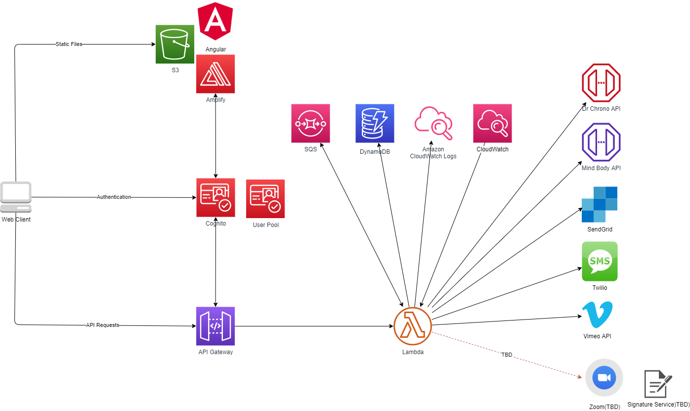

# MemberPortal
Mono repo for Mindworx Patient Experience project

## Architecture
The Member Portal is a web application that adopts Serverless Architecture. 

### Components

* The website is built with Angular and deployed to AWS S3. It integrates with AWS Amplify and uses Cognito for authentication. [AWS Amplify Doc](https://docs.amplify.aws/start/q/integration/angular)

* The Cognito manages user authentication. The User Pool stores user data defined by the requriement documents.

* API Gateway is public facing and only accepts cognito-authenticated requests. It does not validate user role and access.

* Lambda Functions written in C#(.Net Core 3.1) or Python 3. There are 3 groups of lambda functions based on how they are invoked.
  * Driven by API requests: such as User Profile Manager, Appointment Manager, etc.
  * Driven by Cloudwatch events: Such as Appoinemnt Reminder Checker.
  * Driven by SQS: such as a Notification Sender. 

* SQS is used for workflow where asynchronous operation is perferred. For example, when a user books an appointment, the confirmation email can be sent asynchronously at a later time. The "appointment-booked" event is stored in SQS and trigger a Notification Sender lambda.

* DynamoDB stores any data not supported by DrChorno and MindBody. 

* Cloudwatch stores the lambda execution logs and Scheduled Events to trigger lambda executions.

* DrChrono API: https://app.drchrono.com/api-docs/

* MindBody API: https://developers.mindbodyonline.com/PublicDocumentation/V6

* SendGrid API: https://docs.sendgrid.com/api-reference
  * C# client: https://github.com/sendgrid/sendgrid-csharp

* Twilio SMS API: https://www.twilio.com/docs/sms

* Vimeo API: https://developer.vimeo.com/api

